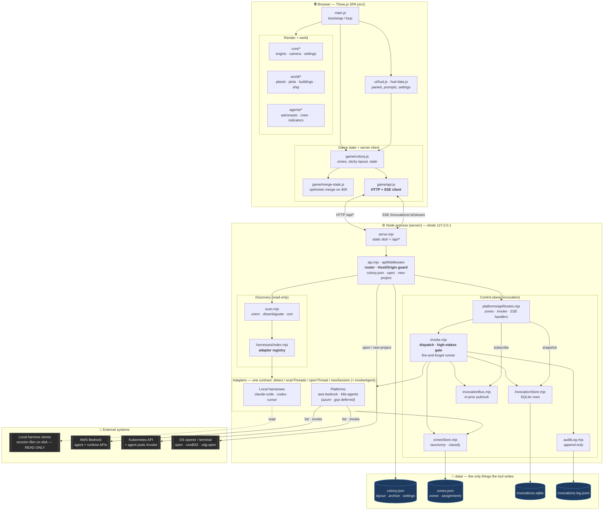

# Habitat Control — Architecture Component Diagram

> **Companion to:** [`SPEC.md`](SPEC.md) (product) · [`HABITAT_CONTROL_ARCHITECTURE.md`](HABITAT_CONTROL_ARCHITECTURE.md) (invocation flow)
> **Scope:** the whole running system — a single-process, localhost Node server serving a
> Three.js SPA, reading every local harness and cloud platform, and invoking cloud agents.
> Grounded in the code under [`bot-views/`](bot-views/), not an aspirational design.

This is a **C4-ish component view**: containers (browser, server process, data dir, external
systems) with the modules inside each and the calls between them. One process, one user, one
machine — the boundaries below are module seams, not network hops, except where labelled.

---

## 1. Component diagram

---

## 2. Components at a glance

| Component | File(s) | Responsibility |
| --- | --- | --- |
| **SPA bootstrap + render** | `src/main.js`, `src/core/*`, `src/world/*`, `src/agents/*` | Draw the hex colony; animate astronaut/thread state. |
| **HUD** | `src/ui/hud.js`, `hud-data.js` | Panels, prompt entry, settings, high-stakes confirm. |
| **Colony state** | `src/game/colony.js`, `merge-state.js`, `hidden-projects.js` | Sticky zone layout, archive set, settings; client-side conflict merge. |
| **Server client** | `src/game/api.js` | The only thing that talks to the backend: `fetch` for `/api/*`, `EventSource` for SSE. |
| **HTTP server / trust boundary** | `server/serve.mjs`, `server/api.mjs` | Serve `dist/`, route `/api/*`, enforce `Host`/`Origin` (`isLocalRequest`), own `colony.json`, run OS opener for open/reveal/new-project. |
| **Discovery** | `server/scan.mjs`, `server/harnesses/index.mjs` | Ask every *detected* adapter for threads; stamp source, disambiguate names, sort by recency. Never writes. |
| **Adapters** | `server/harnesses/{claude-code,codex,cursor}.mjs`, `server/platforms/{aws-bedrock,k8s-agents}.mjs` | One contract — `detect / scanThreads / openThread / newSession`, plus optional `invokeAgent`. Local = files; cloud = SDK/HTTP. |
| **Control plane** | `server/platforms/apiRoutes.mjs`, `invoke.mjs` | Zone CRUD; validate + high-stakes gate; fire-and-forget runner; SSE handler. |
| **Invocation store** | `server/platforms/invocationStore.mjs` | One SQLite row per invoke (`node:sqlite`, lazy singleton). Source of truth for status/output. |
| **Invocation bus** | `server/platforms/invocationBus.mjs` | In-process `EventEmitter` pub/sub — wakes open SSE streams without polling. |
| **Zones store** | `server/platforms/zonesStore.mjs` | Taxonomy (`zones.json`): labels, `highStakes`, agent→zone assignments, keyword `classifyZone`. |
| **Audit log** | `server/platforms/auditLog.mjs` | Append-only JSONL — every invoke, its outcome. |
| **Poll cache** | `server/platforms/cache.mjs` | TTL cache so cloud adapters don't hit AWS/K8s on every scan. |

---

## 3. Key data flows

**A. Presence (read path) — "who needs me?"**
`api.js GET /api/threads` → `apiMiddleware` → `scan.scanThreads()` → each detected adapter
(`scanThreads`) → local session files **or** Bedrock/K8s APIs (via `cache.mjs`) → union +
`disambiguateProjects` + `reconcileArchived` → JSON → SPA renders astronauts. **No writes.**

**B. Colony state (read/write) — sticky layout & settings**
`GET/PUT /api/state` ↔ `colony.json`. Browser owns the file and PUTs it whole; server does
optimistic concurrency on `baseUpdatedAt` (409 → client `merge-state.js` → retry). This is the
**one file the tool writes** for map/layout/settings.

**C. Open / new space (side-effecting, local)**
`POST /api/open` → adapter `openThread(ref)` → `present()` → `launch()` (OS deep link, or Linux
terminal fallback). `POST /api/new-project` additionally `mkdir`s a folder under
`HABITAT_CONTROL_PROJECTS_ROOT` before opening Claude Code — the one place the tool causes a
project to exist.

**D. Invocation (write path) — async + streaming**
`POST /api/invoke` → `invokeHandler` → `invokeAgent()`: look up adapter by `platformId`, resolve
zone, **high-stakes gate** (`confirmed:true` required, checked *before any row exists*), write a
`queued` row, return **202** immediately. Background `runInvocation()` (nothing awaits it) calls
`adapter.invokeAgent(ref, {prompt, onChunk})` → Bedrock native stream / K8s `/invoke` chunks →
each chunk `appendOutput` (SQLite) + `publish` (bus). Terminal `done`/`error` sets status and
writes one `auditLog` line.

**E. Streaming (read-back)**
`EventSource GET /api/invocations/:id/stream` → `streamInvocationHandler` emits a **`snapshot`
first** (from SQLite, so reconnects/late subscribers never miss where it landed), then
`subscribe`s to the bus for live `status`/`chunk`/`done`/`error`; closes on terminal.

---

## 4. Architectural properties (and where they live)

- **One adapter contract, two worlds.** Local harnesses and cloud platforms implement the *same*
  `{id,name,detect,scanThreads,openThread,newSession}` shape (`harnesses/index.mjs` concatenates
  `PLATFORMS`), so a Bedrock agent renders as an astronaut with no cloud-specific UI code. Adding
  a harness = one file + one line.
- **Read-mostly by construction.** The entire discovery path never writes a harness record;
  writes are confined to `data/` (colony/zones/sqlite/log) and to `mkdir`/OS-open side effects.
- **Trust boundary is a single choke point.** `isLocalRequest()` (Host + Origin, applied once at
  the top of `apiMiddleware`) is the whole defense — sized for a localhost read-mostly viewer.
  The write surface (invoke, new-project) rides the *same* guard, which is why any tunneled
  exposure is gated on the trust-model ADR (SPEC §P2.4).
- **Single-process assumptions are load-bearing.** In-memory `invocationBus` and the
  lazy-singleton SQLite connection encode "one process, one user." Multi-process would require
  replacing both (SPEC §P2.3) — documented so it isn't tripped over.
- **SQLite = truth, bus = notification.** The bus only carries post-subscribe events; anything
  durable comes from the store's snapshot. A restart loses listeners, never state.

---

## 5. Trade-offs worth revisiting as it grows

| Decision | Why now | Revisit when |
| --- | --- | --- |
| In-memory pub/sub | Zero deps, perfect for one process | Second process / HA → Redis/NATS or DB polling |
| Lazy-singleton SQLite | Node built-in, no server | Concurrent writers, or volume beyond one user → Postgres (arch §7) |
| Host/Origin as sole auth | Localhost-only threat model | Any exposure beyond loopback → bearer/Access + move high-stakes off a body flag |
| Live discovery as registry | No hand-maintained table | Invoking an agent `scanThreads()` never saw → real `endpoint_ref`/`auth_ref` registry |
| `HABITAT_CONTROL_DATA` resolved in 4 files | Grew organically | Now → one `config.mjs` (SPEC §P1.6, ends the drift) |

---

*Diagram renders on GitHub and any Mermaid viewer. Regenerate this doc whenever an adapter is
added or a store/route changes shape.*
